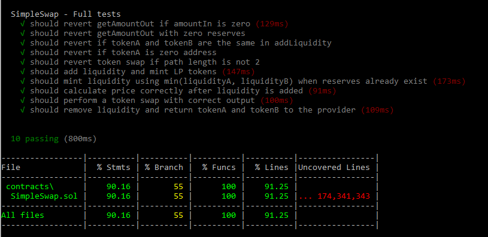

# SimpleSwap dApp – Module 4 Project

This repository contains the practical project for **Module 4**, building on the `SimpleSwap` smart contract from Module 3. The goal was to create an interactive front-end and implement automated testing with at least 50% coverage.

---

### Smart Contract Interaction

- A responsive and styled front-end was developed using:
  - **HTML + JavaScript + Ethers.js**
  - [TailwindCSS](https://cdn.jsdelivr.net/npm/tailwindcss@2.2.19/dist/tailwind.min.css)
  - [Font Awesome 6](https://cdnjs.cloudflare.com/ajax/libs/font-awesome/6.0.0-beta3/css/all.min.css)

- Features include:
  - Connect to MetaMask wallet
  - Swap **Token A ↔ Token B**
  - Fetch token price using `getPrice`
  - Live price estimate when entering input amount
  - Execute token swaps with **0.5% slippage tolerance**
  - Approve tokens for swap
  - Mint 1000 TKA and 1000 TKB

## How to Use the SimpleSwap DApp

1. **Make sure your MetaMask wallet is connected to the Sepolia testnet** and has some Sepolia ETH to cover gas fees.

2. **Visit the deployed dApp:**  
   [https://gadgimax.github.io/ETHKIPUMOD4/](https://gadgimax.github.io/ETHKIPUMOD4/)

3. **Connect your wallet:**  
   Click the **"Connect Wallet"** button at the top. MetaMask will guide you through the connection steps.

4. **Mint test tokens (TKA and TKB):**  
   - Click **"Mint TKA"** to mint 1000 Token A.  
   - Click **"Mint TKB"** to mint 1000 Token B.  
   - Each button will change to "minting..." while the transaction is pending.  
   - You will see a confirmation alert once minting is complete.

5. **Approve token spending:**  
   - Click **"Approve Tokens"** to let the SimpleSwap contract spend your TKA and TKB.  
   - MetaMask will prompt you to approve TKA first.  
   - After that, it will ask to approve TKB.  
   - Once both approvals are complete, you'll see a final alert confirming success.

6. **Swap tokens:**  
   You are now ready to swap between TKA and TKB using the interface!

---

### Development Environment & Testing

- Developed using **Hardhat**
- Unit testing with `Chai` and Hardhat Toolbox
- Code coverage measured with: 'npx hardhat coverage'

- Achieved **≥ 50% test coverage**

To run the contract tests and check coverage:

1. Clone the repository:  
   git clone https://github.com/gadgimax/ETHKIPUMOD4.git

2. Navigate to the Hardhat project folder:  
   cd ETHKIPUMOD4/hardhat

3. Install dependencies:  
   npm install

4. Run the tests with coverage:  
   npx hardhat coverage

The following test cases were implemented to validate the behavior of the `SimpleSwap` smart contract:

**Validation & Revert Checks**

- Reverts if `getAmountOut` is called with zero input.
- Reverts if `getAmountOut` is called with zero reserves.
- Reverts if the same token address is used for both inputs in `addLiquidity`.
- Reverts if one of the token addresses is the zero address in `addLiquidity`.
- Reverts if the swap path length is not exactly 2 in `swapExactTokensForTokens`.

**Liquidity Management**

- Successfully adds liquidity and mints LP tokens.
- Mints correct amount of LP tokens using `min(liquidityA, liquidityB)` when reserves already exist.
- Removes liquidity and correctly returns tokenA and tokenB to the liquidity provider.

**Swapping & Price Calculation**

- Calculates price correctly after liquidity is added (`getPrice`).
- Executes token swap with expected output using `swapExactTokensForTokens`.

---

### Tools Used

- **Front-end:**  
  HTML + JavaScript, TailwindCSS, Font Awesome, Ethers.js

- **Smart Contracts:**  
  Solidity (ERC20s and SimpleSwap)

- **Testing & Dev Environment:**  
  Hardhat, Chai, hardhat-toolbox, hardhat-coverage

---

## 📁 Swap Code and Files Structure

- `SimpleSwap.sol`: Complete source code of the LP token contract with swap and liquidity functionality.
- `TokenA.sol`: Complete source code of Token A (TKA) contract.
- `TokenB.sol`: Complete source code of Token B (TKB) contract.

## 📚 Key Functions

### `swapExactTokensForTokens(...)`

Swaps an exact input amount of one token for as many output tokens as possible.

**Inputs:**
- `uint amountIn` — Exact amount of input tokens to swap  
- `uint amountOutMin` — Minimum acceptable amount of output tokens (slippage protection)  
- `address[] path` — Must be length 2: `[tokenIn, tokenOut]`  
- `address to` — Recipient of the output tokens  
- `uint deadline` — Unix timestamp after which the transaction is invalid

**Returns:**
- `uint[] amounts` — `[amountIn, amountOut]` of tokens swapped  

---

### `getPrice(...)`

Returns the current price of one token in terms of another.

**Inputs:**
- `address tokenA` — Token to price  
- `address tokenB` — Token used as reference

**Returns:**
- `uint price` — Price of `tokenA` in `tokenB` units (scaled by 1e18)  

---

### `getAmountOut(...)`

Calculates the output amount given an input amount and pool reserves.

**Inputs:**
- `uint amountIn` — Input token amount  
- `uint reserveIn` — Reserve of the input token in the pool  
- `uint reserveOut` — Reserve of the output token in the pool

**Returns:**
- `uint amountOut` — Amount of output token received  

---

### Deployment

- [TKA (Token A)](https://sepolia.etherscan.io/address/0x697abAFb930a37c44F06742915B77CBC67945e09#code)
- [TKB (Token B)](https://sepolia.etherscan.io/address/0xfeB21BD73EcC7B4923A637603312C300ebEE5A9E#code)
- [SimpleSwap Contract](https://sepolia.etherscan.io/address/0x39f15be6161cD3b9E05Ca2a0dAa00BeB7E5D9A15)

- **Live dApp on GitHub Pages:**  
  [https://gadgimax.github.io/ETHKIPUMOD4/](https://gadgimax.github.io/ETHKIPUMOD4/)

### Author

Developed by **Gaston Gorosito**  
GitHub: [https://github.com/gadgimax](https://github.com/gadgimax)

